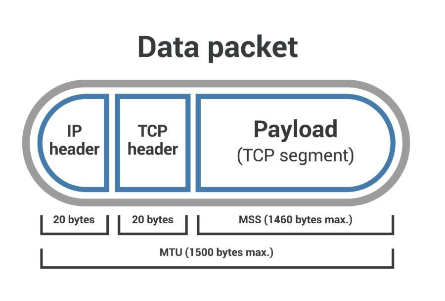

What is MSS(maximum segment size)?
    - MSS limits the size of packets, or small chunks of data that travel
    across a network(network layer on the OSI model).
    - Packets have several headers to them that contain information about
    their contents and destination
    - MSS is the non-header portion of the packet, aka payload.
    - MSS is the largest TCP(Transport Control Protocol) segment size that a 
    network-connected device can recieve. This is the length of the payload, not
    any attached headers. 
    

MSS:
    - MTU, or the maximum transmission unit that includes the TCP and IP headers.
    
    Equation: MTU - (TCP header + IP header) = MSS
    
    - The main difference between MTU and MSS is that if a packet exceeds a device's MTU, it is broken up into smaller pieces, or "fragmented." 
    - But, if a packet exceeds the MSS, it is dropped and not delivered.

What is TCP? What is a TCP header?
    - TCP ensures data packets are delivered and recieved in order, with no dropped packets. 
    - Opening a connection between two devices that are communicating via a process called TCP handshake. 
        * The MSS is agreed upon during the TCP handshake: both devices communicate the size of the packets they are able to recieve(MSS clamping)
    - Adds a header to all packets to indicate which open connection each packet is a part of

How long are TCP and IP headers?
    - TCP headers are 20 bytes long. 
    - IP headers include info about source and destination IP address, also 20 bytes long.
    - Both TCP and IP packets have optional fields that can make headers longer.

IPsec impact MSS?
    - IPsec(Internet Protocol Security) is the encrypted version of IP.
    - Data packets sent using IPsec are scrambled so only two connected devices are able to interpret them, so their payload contents are secure for anyone who might intercept the packets.
    - Used to setup Virtual Private Networks, or VPNs. 

    New Eq:
    * MTU - (TCP header + IP header + IPsec) = MSS

What is MSS clamping?
    - A router along a network has an MTU value lower then 1500 bytes, but this can result in packet loss.
    - To avoid this we can configure the server to apply an MSS clamp: during the TCP handshake, the server can signal the MSS for packets it is willing to recieve, "clamping" the max payload size from the sending server.
    - another form of MSS clamping is GRE tunneling, where a 24-byte header is added to original packet in order to send it to a new destination.

What goes in a GRE header?
    - GRE adds two headers to each packet: the GRE header, which is 4 bytes long, and an IP header, which is 20 bytes long.
    - The GRE header indicates the protocol type by the encapsulated packet, this emits an IP and added on the packet
    - The IP header encapsulates the original packet's header and payload.
