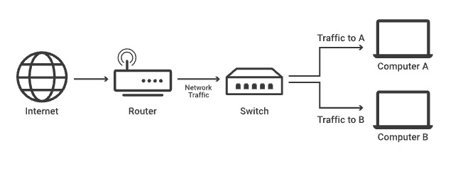
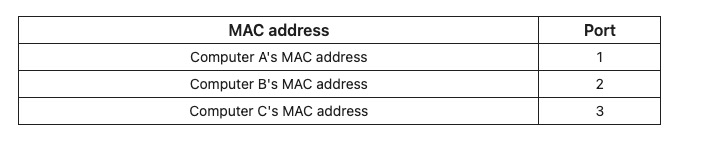

# What is a network switch?
- A network switch connects devices within a network(LAN) and forwards data packets to and from those
devices
- A switch only sends data to the single device it is intended for, not to networks of multiple devices.

## Difference between a switch and a router
- A router selects paths for data packets to cross networks and reach tehir destinations. 
    - Connects with different networks and forwards data from network to network. This includes LANs, 
    WANs, or AS 
- Routers are needed for an Internet connection, while switches are only used for interconnecting devices. 

## Layer 2 switch vs Layer 3 switch 
- Network switches operate on Layer 2 of the OSI model or Layer 3 of the network layer. 
- Layer 2 switches forward data based on the destination MAC address while layer 3 switches forward data
based on the destination IP address 
- Most switches are layer 2 switches. Layer 2 switches often connect to devices in their networks using
Ethernet cables 

## Unmanaged switch vs Managed switch
- Unmanaged switch creates more Ethernet ports on LAN, so more local devices can access the internet. 
    - They pass data back/forth based on MAC addresses on a device
- Managed switch allow administrators to set up VLANs to further subdivide a local network into smaller
chunks 

## What is the difference between a MAC address and an IP address?
- Every device that connects to the Internet has an IP address. 
- IP addresses act like a mailing address, enabling Internet communications directed at that address to reach
that device. IPs change often due to their being a limited number of IPv4 addresses.
- IP addresses are used at layer 3, which means computers and devices all over the Internet use IP addresses for sending and receiving data. 
- MAC addresses are a permanent identifier for each piece of hardware, like a serial number(they dont change!!)
- MAC addresses are used at layer 2 not layer 3. They are not included in IP packet headers, and only apart of given network. 

## How do network switches know the MAC addresses of the devices in their network?
- In layer 2 network switches maintain a table in memory that matches MAC addresses to switch Ethernet ports aka Content Addressable Memory(CAM)

- Here is an example of the table.
- When the table has yet to be made, the steps to actually assign addresses and ports go like below:
Ex: Suppose Computer A sends a message to Computer B
1) It records Computer A's MAC address and the port its message came in on
2) It forwards Computer A's message to all other computers on the network (except Computer A); this is known as "flooding"
3) When Computer B replies, it records Computer B's MAC address and port as well